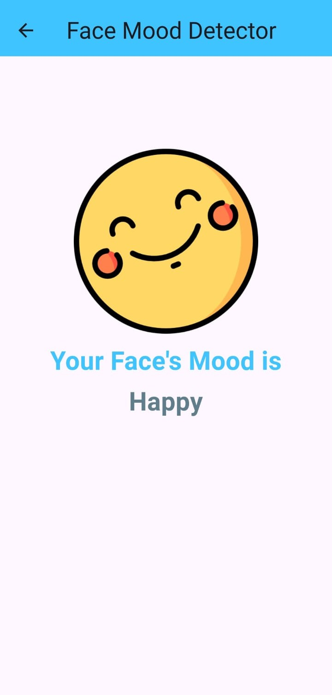

# Face Mood Detection App

An innovative Flutter-based application for detecting facial expressions and analyzing mood using `Google ML Kit`. This app captures an image from the camera or gallery, processes it using machine learning models, and classifies the mood into predefined categories: happy, normal, sad, and angry. The project is designed with a clean, animated UI, powered by the GetX state management library.

## Features

- **Real-time Face Detection**: Utilizes Google ML Kit for facial analysis and mood classification based on the smiling probability.
- **Mood Categories**: Classifies moods into "Happy," "Normal," "Sad," and "Angry" with confidence levels displayed for each detection.
- **Responsive & Animated UI**: Smooth animations with `GetX` controllers for circle transitions and text animations.
- **Loading Screen**: A visually appealing loading screen to enhance user experience while processing images.
- **Supports Camera and Gallery Inputs**: Flexible options for capturing an image from the camera or selecting from the gallery.

## Dependencies

- **Flutter**: 3.0 and above
- **Google ML Kit**: `google_ml_kit` (for face and emotion detection)
- **GetX**: For state management and animations
- **Image Picker**: For selecting images from camera or gallery

## Screenshots




## Contributing

Contributions are welcome! Feel free to open issues or submit pull requests to improve this project.

## Getting Started

To get started with this project, clone the repository and ensure you have Flutter and the necessary dependencies installed.

```bash
git clone https://github.com/username/face-mood-detection.git
cd face-mood-detection
flutter pub get
flutter run
